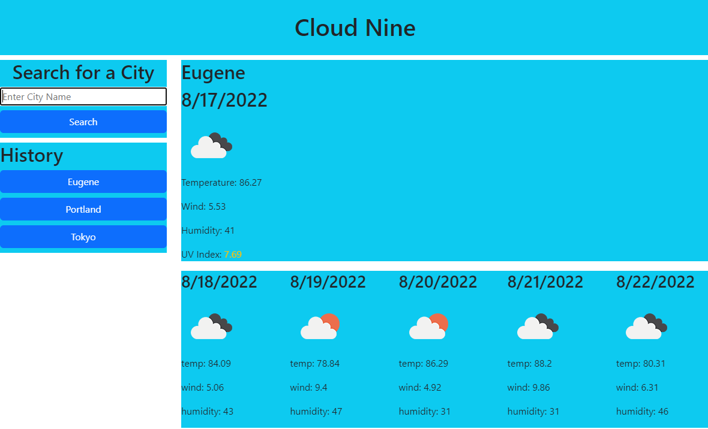

# cloud-nine-weather-app

https://palminski.github.io/cloud-nine-weather-app/

## Description
Enter the name of a location to the left to be presented with data for said location on the right side of the page! Big container has the current days weather while the smaller 5 below contain weather for the rest of the week. 5 most recent searches will be saved in history where they can be clicked to research for that location. these results will be saved to local storage. additionally the same term can not be searched twice.

## How it works
When a term is entered into the search bar it is checked with the openweather geolocator API and converted into latitude and longitude cordinates. from there the cordinates are run through the onecall API from where data is displayed onto the page.

## notes
You may notice that I am using two different API keys. The reason for this is that for some reason my API key would not work with the onecall API. when I reached out to a learning assistant they gave me their key to use instead. I didn't want to make too many calls with their key, so I used my own for the grolocator API